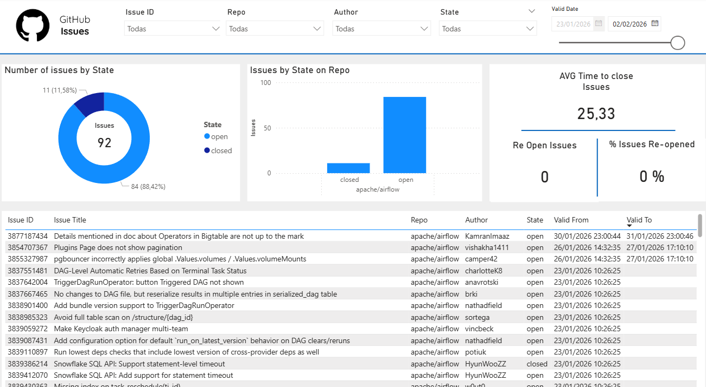

# 🚀 GitHub Issues Analytics Pipeline  
### End-to-End Data Engineering Project (GCP · BigQuery · Power BI)

Este proyecto implementa un **pipeline de datos de extremo a extremo** para la **ingestión, historificación, análisis y visualización de GitHub Issues**, utilizando **Google Cloud Platform** como plataforma de datos y **Power BI** como capa de reporting.

El objetivo principal es analizar el **ciclo de vida real de las issues** (*open → closed → re-opened*), medir **tiempos de resolución**, detectar **reaperturas** y construir **KPIs reutilizables y escalables**.

---

## 🧱 Arquitectura del proyecto

GitHub API
->
Python Ingestion (Cloud Run Job)
->
BigQuery (raw_data)
->
BigQuery Analytics Layer (SCD Type 2 + Views)
->
Power BI Dashboard

---

## 🛠️ Tecnologías utilizadas

- **Python 3**
- **GitHub REST API**
- **Docker**
- **Google Cloud Run (Jobs)**
- **Cloud Scheduler**
- **BigQuery**
- **Power BI**
- **IAM & Service Accounts**

---

## 📥 Ingestión de datos

La ingestión de datos se realiza mediante un **script en Python** que consume la **GitHub API** y carga la información en **BigQuery**.

### Características principales
- Extracción de **issues** desde repositorios GitHub
- Normalización de datos
- Añadido del campo **`ingestion_date`**
- Carga incremental en **BigQuery**
- Ejecución **serverless** mediante **Cloud Run Job**
- Imagen Docker construida con **Cloud Build**
- Ejecución **automática diaria** usando **Cloud Scheduler**
- Autenticación mediante **Service Accounts** (sin credenciales hardcodeadas)

---

## 🗄️ Modelo de datos en BigQuery

### 📂 Dataset: `raw_data`

#### `github_issues`
Tabla de ingestión directa desde la API de GitHub.  
Contiene **snapshots** del estado de las issues en cada ejecución.

Campos principales:
- `issue_id`
- `number`
- `title`
- `state`
- `author`
- `repo`
- `ingestion_date`

---

### 📂 Dataset: `analytics`

#### 1️⃣ `issues`
Tabla maestra con **una fila por issue**.

Campos:
- `issue_id`
- `number`
- `title`
- `author`
- `repo`

---

#### 2️⃣ `issue_status_history` (SCD Type 2)

Tabla histórica que implementa un **Slowly Changing Dimension Type 2** para el estado de las issues.

Campos:
- `issue_id`
- `state`
- `valid_from`
- `valid_to`
- `is_current`

Permite reconstruir el **historial completo de cambios de estado** de cada issue.

---

#### 3️⃣ Vistas analíticas

##### 🔹 `issue_resolution_time`
- Calcula el tiempo entre **open → closed**
- Base del KPI **AVG Time to Close Issues**

##### 🔹 `reopened_issues`
- Detecta transiciones **closed → open**
- Identifica issues reabiertas

👉 Toda la **lógica de negocio** se resuelve en **BigQuery**, dejando **Power BI** como capa puramente visual.

---

## 📊 Power BI Dashboard

El dashboard final permite un análisis completo del estado y calidad del proceso de resolución de issues.

### KPIs principales
- **Total de Issues**
- **Issues Open vs Closed**
- **AVG Time to Close Issues**
- **Re-opened Issues**
- **% Issues Re-opened**

### Visualizaciones
- Distribución de issues por estado
- Issues por repositorio
- Tabla detallada con:
  - Issue ID
  - Título
  - Repositorio
  - Autor
  - Estado
  - Valid From / Valid To

### Filtros disponibles
- Issue ID
- Repositorio
- Autor
- Estado
- Rango de fechas (**Valid Date**)

---

## ⏱️ Automatización

- **Cloud Scheduler** ejecuta el pipeline de forma **diaria**
- El scheduler lanza un **Cloud Run Job**
- Pipeline **100% automatizado y serverless**
- Sin intervención manual

---

## 🔐 Seguridad y buenas prácticas

- Uso exclusivo de **Service Accounts**
- Principio de **mínimos privilegios**
- Separación clara de capas:
  - **raw_data**
  - **analytics**
  - **reporting**
- Sin secretos ni credenciales en código

---

## 📈 Posibles mejoras y extensiones

- SLA breach detection
- Tiempo medio entre reaperturas
- Issues más problemáticas
- Análisis por autor o equipo
- Soporte multi-repositorio
- Incremental loading optimizado

---

## 👤 Autor

Proyecto desarrollado por **Jorge Román**  
Enfocado en **Data Engineering / Analytics Engineering** sobre **Google Cloud Platform**.
